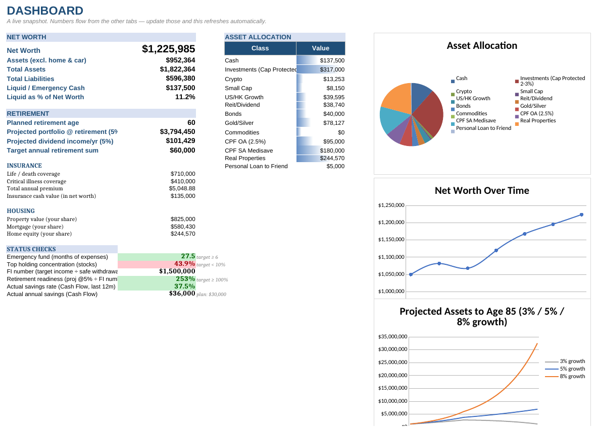
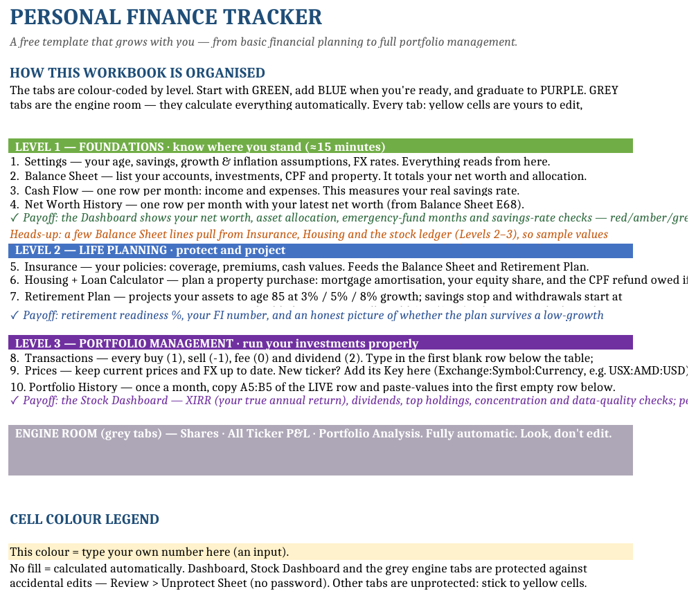
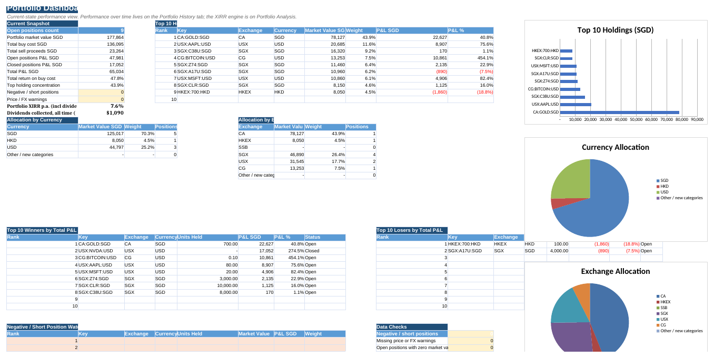
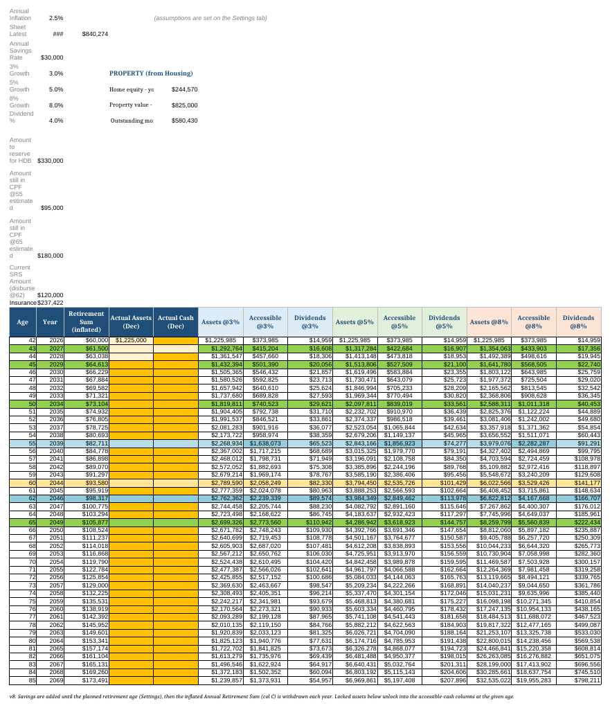

# Personal Finance Tracker (Excel)

A free Excel template that grows with you — from basic financial planning to full portfolio management. Built around a three-level journey: know where you stand, plan your future, then run your investments properly. No macros, no add-ins, no internet access — just formulas you can inspect.

## Why this template

Most finance spreadsheets are either a simple budget or an intimidating investment model. This one is organised as a **learning path**: the tabs are colour-coded by level, and each level unlocks a visible payoff on the Dashboard. Fill in the green tabs in ~15 minutes and you get your net worth, allocation and red/amber/green health checks. Work up to the purple tabs and you get a transaction-ledger-driven portfolio tracker with true money-weighted returns (XIRR), dividend tracking and a monthly performance history.

## The three levels

| Level | Tabs | What you get |
|---|---|---|
| 🟩 **1 — Foundations** (~15 min) | Settings · Balance Sheet · Cash Flow · Net Worth History | Net worth, asset allocation, emergency-fund months, measured savings rate — with red/amber/green status checks |
| 🟦 **2 — Life Planning** | Insurance · Housing · Loan Calculator · Retirement Plan | Retirement readiness %, your FI number, mortgage amortisation, CPF refund on sale, projections to age 85 at 3/5/8% growth |
| 🟪 **3 — Portfolio Management** | Transactions · Prices · Stock Dashboard · Portfolio History | XIRR (true annual return), dividends, top holdings, concentration & data-quality checks, contribution-adjusted monthly returns |
| ⬜ **Engine room** | Shares · All Ticker P&L · Portfolio Analysis | Fully automatic — look, don't edit |

## Quick start

1. Download **Personal Finance Tracker v1.0.xlsx** and open it in Excel (LibreOffice works too).
2. Read the **Start Here** tab — it is the manual.
3. Everything ships with a coherent fictional example (a 42-year-old investing since 2019) so every formula shows a working result. Follow the *Resetting the Sample Data* checklist on Start Here to make it yours.
4. Yellow cells are yours to edit; everything else is formulas. Formula-heavy sheets are protected against accidents — no password, `Review → Unprotect Sheet` if you ever need to.

### The monthly routine (~10 minutes)

1. Update **Prices** (prices & FX).
2. Add a row to **Cash Flow** (income & expenses).
3. Add a row to **Net Worth History**.
4. Copy `A5:B5` of the LIVE row on **Portfolio History** and paste-values below — this turns snapshots into a track record.

## The stock ledger

One transactions table drives the entire portfolio layer. Four action codes:

| Code | Meaning | Units | Total after fees |
|---|---|---|---|
| `1` | Buy | bought | cost incl. fees |
| `-1` | Sell | sold | proceeds after fees |
| `0` | Fee / charge | 0 | fee amount |
| `2` | Dividend received | 0 | amount received |

Tickers use a `Exchange:Symbol:Currency` key (e.g. `USX:AMD:USD`). Anything can be a ticker — the sample tracks physical gold as `CA:GOLD:SGD`, and you can do the same for CPF or bonds. The ledger handles multiple currencies (SGD/USD/HKD out of the box; add more in Settings).

## What gets calculated for you

- **Portfolio XIRR** — money-weighted annual return since inception, dividends included, from your actual dated cash flows.
- **Retirement projection to age 85** — three growth scenarios; savings stop at your retirement age and inflation-adjusted withdrawals begin; CPF/SRS/endowment unlocks flow in at the ages you set. Your retirement-age row highlights automatically.
- **Retirement readiness %** — projected assets at retirement vs your FI number (target income ÷ safe withdrawal rate).
- **Housing** — full amortisation schedule, your equity share, and (Singapore) the CPF refund with accrued interest owed on sale, so you see true cash-in-hand.
- **Status checks** — emergency-fund months, holding concentration, actual-vs-planned savings rate, all red/amber/green.

## Singapore context

Built with Singapore in mind — CPF (OA/SA/Medisave), SRS, SSB, HDB/BSD terms are used and explained on the Settings tab. Everything is a plain labelled input, so replacing these with your local equivalents (401k/IRA, ISA/SIPP, EPF…) takes minutes.

## Good to know

- All numbers and tickers in the file are **fictional sample data**.
- Once filled in, the file is a complete map of your finances — **keep your copy private**.
- Historic FX for the XIRR uses current rates (documented on the Portfolio Analysis tab).
- The ~44% "top holding concentration" red flag in the sample is the check working as intended — small portfolios concentrate easily.
- Not yet built (PRs welcome): benchmark comparison vs an index, YTD return, monthly return bar chart, allocation drift tracking.

## License

[MIT](LICENSE) — free to use, modify and share, including commercially, with attribution.

**Disclaimer:** this template is for personal organisation and education only. It is not financial advice, and its calculations are simplified models — verify anything important with a qualified professional.
