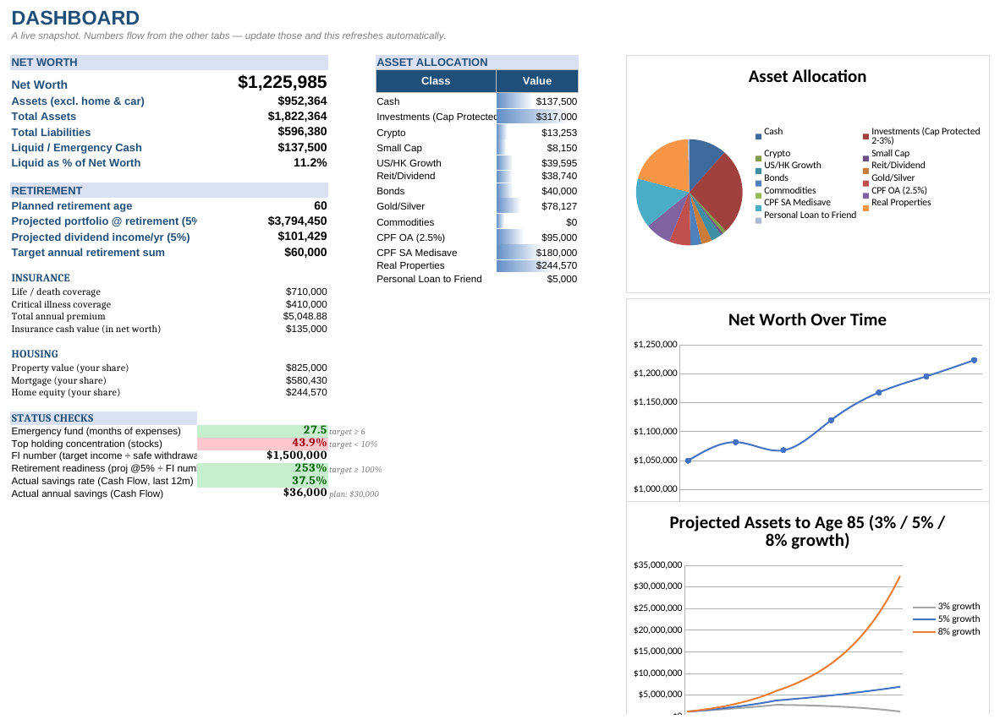
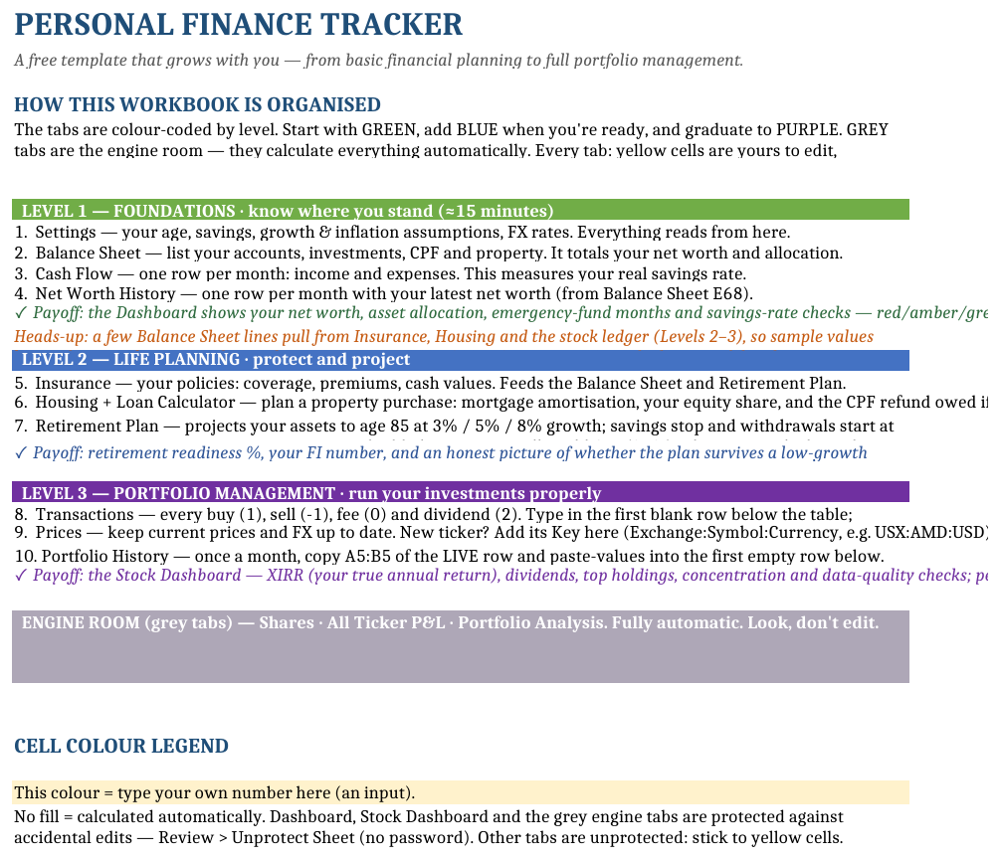
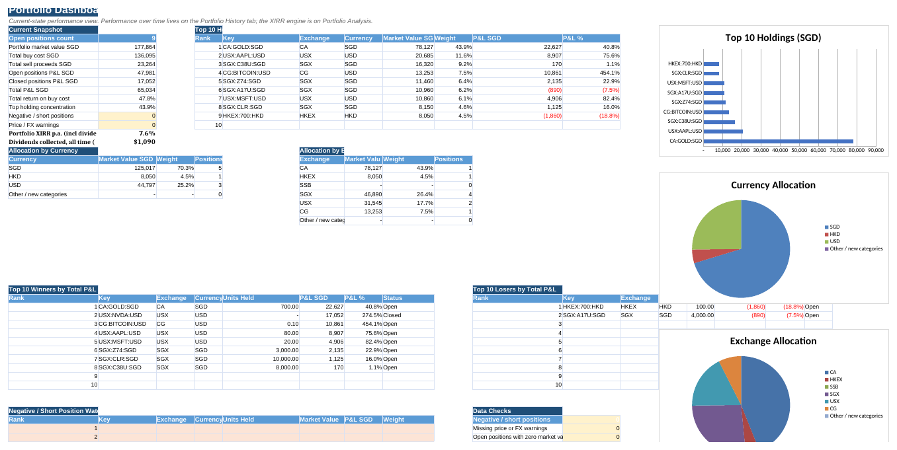
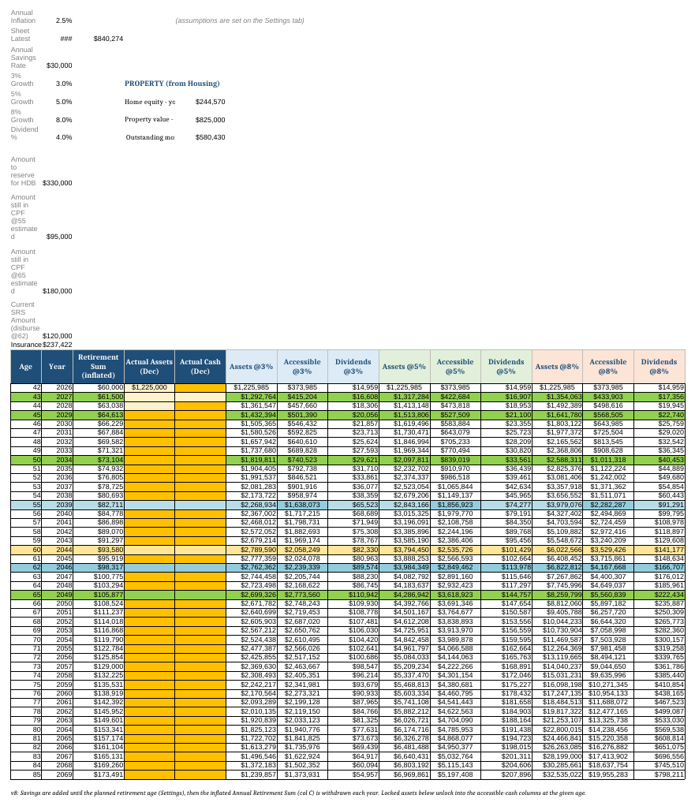

# Personal Finance Tracker (Excel)

A free Excel template that grows with you — from basic financial planning to full portfolio management. Built around a three-level journey: know where you stand, plan your future, then run your investments properly. No macros, no add-ins, no internet access — just formulas you can inspect.



## Why this template

Most finance spreadsheets are either a simple budget or an intimidating investment model. This one is organised as a **learning path**: the tabs are colour-coded by level, and each level unlocks a visible payoff on the Dashboard. Fill in the green tabs in ~15 minutes and you get your net worth, allocation and red/amber/green health checks. Work up to the purple tabs and you get a transaction-ledger-driven portfolio tracker with true money-weighted returns (XIRR), dividend tracking and a monthly performance history.



## The three levels

| Level | Tabs | What you get |
|---|---|---|
| 🟩 **1 — Foundations** (~15 min) | Settings · Balance Sheet · Cash Flow · Net Worth History | Net worth, asset allocation, emergency-fund months, measured savings rate — with red/amber/green status checks |
| 🟦 **2 — Life Planning** | Insurance · Housing · Loan Calculator · Retirement Plan · Savings Goal Calculator | Retirement readiness %, your FI number, mortgage amortisation, projections to age 85 at 3/5/8% growth, plus a goal-based savings calculator |
| 🟪 **3 — Portfolio Management** | Transactions · Prices · Stock Dashboard · Allocation · Portfolio History | XIRR (true annual return), dividends, top holdings, concentration & data-quality checks, contribution-adjusted monthly returns, three-lens allocation (Total / Investible / Risk) |
| ⬜ **Engine room** | Shares · All Ticker P&L · Portfolio Analysis | Fully automatic — look, don't edit |

## Quick start

1. [Download the latest workbook](https://github.com/jovialio/personal-finance-tracker-excel/releases/latest/download/Personal.Finance.Tracker.xlsx) and open it in Excel (LibreOffice works too).
2. Read the **Start Here** tab — it is the manual.
3. Everything ships with a coherent fictional example (a 42-year-old investing since 2019) so every formula shows a working result. Follow the *Resetting the Sample Data* checklist on Start Here to make it yours.
4. Yellow cells are yours to edit; everything else is formulas. Formula-heavy sheets are protected against accidents — no password, `Review → Unprotect Sheet` if you ever need to.

### The monthly routine (~10 minutes)

1. Update **Prices** (prices & FX).
2. Add a row to **Cash Flow** (income & expenses).
3. Add a row to **Net Worth History**.
4. Copy `A5:B5` of the LIVE row on **Portfolio History** and paste-values below — this turns snapshots into a track record.

## The stock ledger

One transactions table drives the entire portfolio layer. Four action codes:

| Code | Meaning | Units | Total after fees |
|---|---|---|---|
| `1` | Buy | bought | cost incl. fees |
| `-1` | Sell | sold | proceeds after fees |
| `0` | Fee / charge | 0 | fee amount |
| `2` | Dividend received | 0 | amount received |

Tickers use a `Exchange:Symbol:Currency` key (e.g. `USX:AMD:USD`). Anything can be a ticker — the sample tracks physical gold as `CA:GOLD:SGD`, and you can do the same for CPF or bonds. The ledger handles multiple currencies (SGD/USD/HKD out of the box; add more in Settings).

Paste or cut/paste transaction values only within columns **A:I**. The 10,000-row `Txn` table keeps its calculated helpers in **J:R**, so normal A:I edits cannot shift the ranges used by Shares. Average buy cost resets when a ticker is fully sold and later re-acquired; same-day transactions follow their physical row order.



## What gets calculated for you

- **Portfolio XIRR** — money-weighted annual return since inception, dividends included, from your actual dated cash flows.
- **Allocation across three lenses** — each holding and asset class as a % of Total assets, Investible and Risk, driven by two editable maps (category → class, class → lens) so adding a category never means editing summary rows.
- **Retirement projection to age 85** — three growth scenarios; savings stop at your retirement age and inflation-adjusted withdrawals begin; CPF/SRS/endowment unlocks flow in at the ages you set. Your retirement-age row highlights automatically.
- **Retirement readiness %** — projected assets at retirement vs your FI number (target income ÷ safe withdrawal rate).
- **Housing** — full amortisation schedule, including your property value, mortgage balance and equity share.
- **Status checks** — emergency-fund months, holding concentration, actual-vs-planned savings rate, all red/amber/green.



## Singapore context

Built with Singapore in mind — CPF (OA/SA/Medisave), SRS, SSB, HDB/BSD terms are used and explained on the Settings tab. Everything is a plain labelled input, so replacing these with your local equivalents (401k/IRA, ISA/SIPP, EPF…) takes minutes.

## Good to know

- All numbers and tickers in the file are **fictional sample data**.
- Once filled in, the file is a complete map of your finances — **keep your copy private**.
- Historic FX for the XIRR uses current rates (documented on the Portfolio Analysis tab).
- The ~44% "top holding concentration" red flag in the sample is the check working as intended — small portfolios concentrate easily.
- Not yet built (PRs welcome): benchmark comparison vs an index, YTD return, monthly return bar chart, allocation drift tracking.

## Companion tool — Monthly Budget Tracker

A separate, single-purpose workbook (`Monthly Budget Tracker.xlsx`) for month-to-month cash-flow budgeting: plan a budget and track actual spending by category, with a dashboard of trends. It's independent of the portfolio tracker above — use either or both.

### How it works

Everything flows from one ledger. You enter each income, expense and one-off item **once** on the **Entries** tab (Date · Category · Type · Amount · Note); the rest is automatic:

- **Categories** — the master list. Add a row (Group = Income / Expense / One-off, Active = Y) and it shows up in the breakdown by itself, no formula editing (room for 20 expense categories); set one to Active = N to retire it.
- **Budgets** — effective-dated. To change a budget, add a new row for the category with a later "Effective From" date; each month uses the latest budget on or before it, so history stays accurate as your lifestyle changes.
- **Monthly Summary** — rebuilds monthly totals, per-category budget-vs-actual, 12-month rolling averages and cumulative cash with `SUMIFS`. It is pre-filled years ahead and each month fills in on its own as you add Entries — nothing to copy down.
- **Dashboard** — cumulative cash, income vs spend, rolling savings ratio, and budget-vs-actual by category.

Tabs are colour-coded — **green = you edit** (Entries, Budgets, Categories), **blue = automatic & locked** (Dashboard, Monthly Summary), **grey = the guide** (Instructions). Formula sheets are protected with no password (`Review → Unprotect Sheet` to change). It ships with fictional sample data (2008–2025) so every formula and chart shows a working result — clear the Entries and Budgets rows (keep the headers) to make it yours. The **Instructions** tab is the full manual.

### Optional: auto-import from bank & card statements

`categorize_expenses.py` turns a bank statement (plus optional credit-card bill PDFs) into a reviewable, paste-ready draft:

- Rules in `rules.csv` (copy `rules.example.csv` to start) map merchants to categories — first match wins; teach a new merchant by adding one line.
- A credit-card payment stays a single line **unless** you attach that card's bill, in which case it is broken down into per-category charges (matched by card number and reconciled to the bill's printed total).
- Transfers to your own accounts and savings are excluded; anything uncertain is flagged for review, and a Validation tab shows a PASS / REVIEW / FAIL status.
- It is built as a template: bank layouts (`BANK_FORMATS`) and card issuers (`CARD_FORMATS`) are pluggable registry entries with worked examples, and an unrecognised or changed format **fails loudly** rather than silently mis-reading.

```text
pip3 install openpyxl pdfplumber
python3 categorize_expenses.py "your bank.xlsx" --bill "card bill.pdf" --month 2025-06 --out "draft.xlsx"
```

The reference parsers target the UOB One Account statement and UOB card bill formats; add a registry entry for other banks/cards (see the commented `TEMPLATE` blocks in the script).

## Changelog

Release notes for every version live in [CHANGELOG.md](CHANGELOG.md).

## Maintainer release flow

Future releases are automated from final-version `v*` tags such as `v1.2` or `v1.2.3`. Prerelease suffixes such as `v1.2-rc1` are intentionally rejected so the stable latest-download URL never points at an RC or beta workbook.

For a new version:

1. Rename the workbook in this repo to match the tag, for example `Personal Finance Tracker v1.2.xlsx`.
2. Commit the workbook and README changes to `main`.
3. Tag the release commit, for example `git tag v1.2 && git push origin main v1.2`.

The release workflow uploads two assets:

- `Personal.Finance.Tracker.v1.2.xlsx` — the version-pinned workbook.
- `Personal.Finance.Tracker.xlsx` — the stable latest-download alias used by README and blog links.

The stable download URL should not change between releases:

```text
https://github.com/jovialio/personal-finance-tracker-excel/releases/latest/download/Personal.Finance.Tracker.xlsx
```

Pull request CI runs a secret scan and validates the workbook filename, XLSX package integrity, README assets, stable download link, workflow YAML, and release asset preparation before merge.

## About

I'm Dennis — I built this to answer my own money questions, then kept refining it until it was worth sharing. I write about the thinking behind it, and what I'm building next, at [blog.synvest.life](https://blog.synvest.life).

## License

[MIT](LICENSE) — free to use, modify and share, including commercially, with attribution.

**Disclaimer:** this template is for personal organisation and education only. It is not financial advice, and its calculations are simplified models — verify anything important with a qualified professional.
